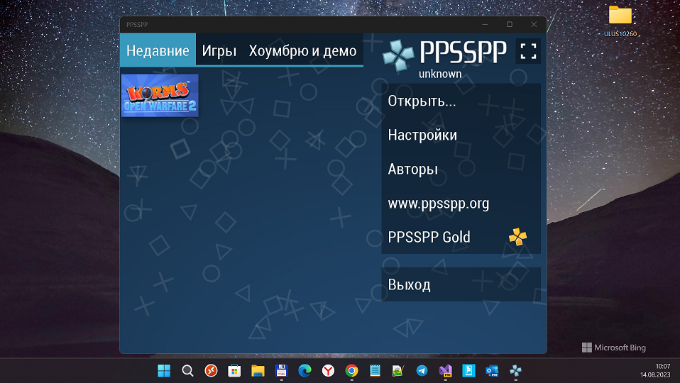
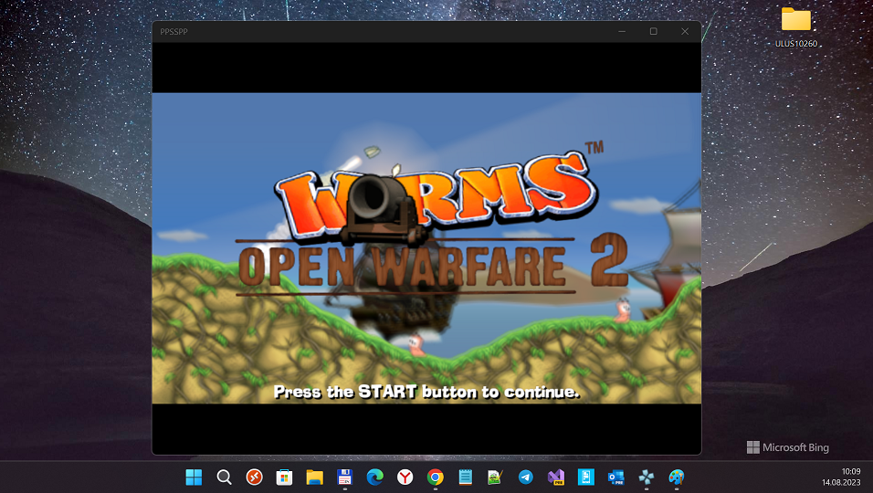

# PPSSPP-UWPP v1.12.3
An micro-RnD of PPSSPP-UWP client for the Windows 10 (Mobile) :)
    
## My "0.1 cents"
1. RnD PPSSPP-UWP by Scemino (https://github.com/scemino/nscumm)
2. RnD PPSSPP_UWP by Bashar Astifan (https://github.com/basharast/NScummUWP) 
3. PPSSPP-UWP "refubrishing" (PPSSPP-UWP+PPSSPP-UWP-ARM synthez...)
4. Some "project modification-experimentation" applied (19041->15063->19041))

## Screenshots / Images

## Build instructions
1. First, check that you have the [necessary tools](#requirements) installed.
2. Clone the repo `git clone --recursive https://github.com/mediaexplorer74/NScummUWP.git`.
3. Update all project dependencies (packages) 
4. Compile the UWP app for needed platform (ARM is best one... but x86 is supported too)
5. Try to load some PPSSPP-UWP-compatible game, i.e. "The Curse of Monkey Island (Windows CD)"
6. Test & enjoy game process, sound tracks, oldschool cool graphics, etc.... =))
 
## Requirements
The following tools and SDKs are mandatory for the project development:
* Visual Studio 2022 Preview, with
    * .NET Native;
    * NuGet package manager;
    * Universal Windows Platform tools;
    * Windows 10 19041 SDK

## Current features
- Game "flight" seems to be ok :)
- Audio / sounds - ok but with some glitches (my dev machine is too old...?)

## Planned features
- Codebase reduction (Shrink iOS, MacOS, etc. :)

## Special thanks
- [Henrik Rydgård](https://github.com/hrydgard) Original ppsspp's developer/author - see his project [ppsspp](https://github.com/hrydgard/ppsspp)
- [Bashar Astifan](https://github.com/basharast) PPSSPP-UWP's developer/remaker/enhancer - see his project [PPSSPP-UWP](https://github.com/basharast/PPSSPP-UWP-ARM) 

## License
Copyright © 2015-2023 [PPSSPP-UWP](https://github.com/hrydgard/graphs/contributors).

## ..
AS IS. No support. RnD only. DIY

## .
[m][e] 2023
